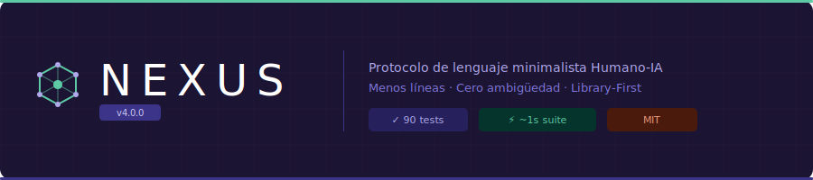

<p align="center">
  
</p>

<p align="center">
  
</p>

# 🌌 Protocolo NEXUS — nxlang

> **Deja de escribir prompts. Empieza a escribir intenciones.**

[](https://www.npmjs.com/package/nxlang)
[](./LICENSE)
[]()
[]()

**NEXUS** es un protocolo de lenguaje minimalista Humano-IA que comprime arquitecturas de software complejas en fragmentos precisos y sin ambigüedad. Construido como núcleo library-first — diseñado para potenciar editores de código, herramientas de IA y flujos de trabajo de desarrollo.

[Explorar la Gramática](./NEXUS-Grammar.md) · [Reportar un Error](https://github.com/open-souse/Nexus/issues) · [Solicitar una Función](https://github.com/open-souse/Nexus/issues)

---

## El Problema

El lenguaje natural es hermoso para la poesía. Es peligroso para el software.

Cuando describes una arquitectura a una IA en texto libre, obtienes: patrones alucinados, código inconsistente, tokens desperdiciados y horas de corrección. A mayor longitud del prompt, mayor ambigüedad. A mayor ambigüedad, menor confianza en el resultado.

Este no es un problema del modelo. Es un problema del lenguaje.

---

## La Solución

NEXUS es un protocolo taquigráfico — un shorthand estructurado que un humano escribe y una IA entiende con ambigüedad casi nula.

Lo que toma 100 líneas de lenguaje natural, toma 10 líneas de NEXUS. Lo que 10 líneas de NEXUS describen, la IA lo construye correctamente desde el primer intento.

```nexus
Page Dashboard
  Layout SplitView
  Section Resumen #glass
    Text "Ingresos Totales" !bold
    Chart < DatosVentas
  Section Pedidos
    Table < Pedido [filter:estado=pendiente]
```

Un bloque. Cero ambigüedad. La IA sabe exactamente qué construir.

---

## Por Qué Funciona NEXUS

| Problema | Lenguaje Natural | NEXUS |
|---|---|---|
| Ambigüedad | Alta — "hazlo moderno" | Nula — `#glass !bold` |
| Costo de tokens | 100+ líneas por función | 8–12 líneas por función |
| Consistencia de la IA | Varía por sesión | Determinista por diseño |
| Reglas arquitectónicas | Implícitas | Validadas por el motor |
| Reutilización | Copy-paste de prompts | Archivos `.nexus` estructurados |

---

## Arquitectura

NEXUS v4.0.0 está construido **library-first**. El núcleo es un módulo TypeScript puro sin dependencias del CLI — diseñado para ser embebido en editores, IDEs y herramientas potenciadas por IA.

```
nxlang/
├── core/
│   ├── grammar.ts      ← Fuente única de verdad: keywords, orquestadores, operadores
│   ├── parser.ts       ← Tokenización con conciencia de strings
│   └── validator.ts    ← validateNexus() puro — sin CLI, sin sistema de archivos
├── context/
│   ├── builder.ts      ← buildSystemPrompt() + buildPrompt()
│   └── config.ts       ← createDefaultConfig()
├── cli/
│   ├── init.ts         ← comando nexus init
│   └── validate.ts     ← comando nexus validate
└── lib.ts              ← API pública para consumidores externos
```

**Reglas del núcleo:**
- `core/` no tiene dependencias del CLI ni del sistema de archivos — úsalo en cualquier entorno
- `cli/` consume `core/`, nunca al revés
- `lib.ts` exporta solo la API pública — lo que tu editor necesita para integrarse

---

## Instalación

```bash
# CLI Global — usa NEXUS en tu terminal
npm install -g nxlang

# Librería núcleo — embebe NEXUS en tus propias herramientas
npm install nxlang
```

**Requisitos:** Node.js ≥ 20.0.0

---

## Comandos del CLI

```bash
# Inicializa NEXUS en tu proyecto
# Crea nexus.config.json (el DNA de tu proyecto) y NEXUS.md (archivo de contexto para la IA)
nexus init

# Valida tus archivos .nexus
# Escaneo profundo con reporte de errores preciso por línea
nexus validate ./src/components/dashboard.nexus
```

---

## La Gramática

NEXUS tiene dos dominios: **Frontend** y **Backend**. Cada uno tiene sus propios orquestadores, operadores y modificadores.

### Frontend

```nexus
Page DetalleProducto
  Layout Stack #gap-2
  Section Hero
    Image < producto.thumbnail [ratio:16/9]
    Text < producto.nombre !bold !xl
    Text < producto.precio #accent
  Section Acciones
    ( producto.enStock ) ->
      Button "Agregar al carrito" => CarritoStore.agregar(producto)
    :
      Badge "Agotado" #muted
```

### Backend

```nexus
Model Pedido
  Entity id !pk
  Entity estado default:pendiente
  Entity total [type:decimal]
  Index estado [type:hash]

Controller PedidoController
  policy: esta-autenticado
  Router ApiV1
    Endpoint POST /pedidos < Payload:PedidoSchema => PedidoService.crear()
    Endpoint GET  /pedidos/:id                    => PedidoService.buscarPorId()
    Endpoint PUT  /pedidos/:id/estado             => PedidoService.actualizarEstado()
```

### Operadores Clave

| Operador | Significado |
|---|---|
| `< Fuente` | Binding de datos / recibe de |
| `=> Servicio.metodo()` | Despacho de acción |
| `( cond ) -> A : B` | Renderizado condicional |
| `!modificador` | Flag booleano (`!bold`, `!pk`, `!xl`) |
| `#token` | Token de diseño (`#glass`, `#accent`, `#gap-2`) |
| `$var: valor` | Declaración de variable |
| `@Auth[rol]` | Guard de autenticación |
| `* N` | Repetir N veces |
| `!error:código -> ruta` | Manejo de errores — captura errores HTTP y redirige |
| `[paginate:N]` | Paginación nativa — genera paginación automática |
| `-> Model.Nombre` | Relación entre modelos — define relaciones de base de datos |

[→ Referencia Completa de Gramática](./NEXUS-Grammar.md)

---

## DNA del Proyecto — nexus.config.json

`nexus init` crea el archivo DNA de tu proyecto — una configuración que le dice a la IA exactamente qué stack estás usando antes de leer una sola línea de NEXUS.

```json
{
  "project": "mi-app",
  "modules": ["frontend", "backend"],
  "frontend": {
    "framework": "React",
    "styling": "Tailwind",
    "stateManager": "Zustand"
  },
  "backend": {
    "framework": "Express",
    "database": "MongoDB",
    "auth": "JWT"
  }
}
```

A partir de esta configuración, NEXUS genera `NEXUS.md` — el archivo de contexto que adjuntas a cualquier sesión de IA. El modelo ahora conoce tu stack sin que tengas que explicarlo.

---

## Usando la API de Librería

```typescript
import { validateNexus, buildSystemPrompt, createDefaultConfig } from 'nxlang'

// Validar un archivo .nexus programáticamente
const errores = validateNexus(contenido)
if (errores.length === 0) {
  console.log('Sintaxis NEXUS válida')
} else {
  errores.forEach(e => console.log(`Línea ${e.line}: ${e.message}`))
}

// Generar el system prompt para la IA desde tu configuración de proyecto
const config = await cargarConfig()
const systemPrompt = buildSystemPrompt(config)
// → Pasa esto a tu modelo de IA como mensaje de sistema

// Crear una configuración por defecto programáticamente
const config = createDefaultConfig({ project: 'mi-editor', modules: ['frontend'] })
```

---

## Seguridad

NEXUS v4.0.0 incluye validación defensiva de inputs:

- **Límite de 500 KB por archivo** — rechaza archivos demasiado grandes antes de procesarlos
- **Límite de 2000 líneas** — previene ejecución no acotada
- **Detección de null bytes** — bloquea intentos de inyección binaria
- **Tokenizador consciente de strings** — los tokens dentro de `"contenido entre comillas"` nunca se evalúan
- **Validación estricta de directivas** — `@Auth`, `$variables` y operadores malformados se detectan en tiempo de parseo

---

## Para Constructores de Editores

NEXUS está diseñado para ser el núcleo de editores de código potenciados por IA. Si estás construyendo una herramienta que genera código con IA, NEXUS te da:

- Un **formato de input validado** que tus usuarios escriben
- Un **generador de system prompts** que contextualiza la IA
- Un **validador puro** que embutes en tu language server
- Una **definición de gramática** que usas para syntax highlighting

El editor no necesita entender NEXUS — solo necesita llamar a `validateNexus()` y `buildSystemPrompt()`.

---

## Roadmap

- [x] **v4.0** — Núcleo modular, arquitectura Library-First, seguridad defensiva, 90 tests
- [x] **v4.0.1** — Manejo de errores (`!error`), paginación nativa (`[paginate]`), relaciones entre modelos
- [ ] **v4.5** — Módulo SDD, Motor Semántico (detección de arquitecturas imposibles), CLI Doctor
- [ ] **v5.0** — NEXUS Language Server Protocol (LSP) para integración nativa con editores

---

## Contribuir

NEXUS es un estándar abierto. Las contribuciones son bienvenidas.

Lee [CONTRIBUTING.md](./CONTRIBUTING.md) para aprender cómo participar.

```bash
git clone https://github.com/open-souse/Nexus.git
cd Nexus
npm install
npm run test     # 90 tests, ~1 segundo
npm run build
```

---

## Licencia

MIT — Desarrollado por [Edwin Realpe](https://github.com/edwinreal) · [2026 Ventures SAS](https://github.com/open-souse)
