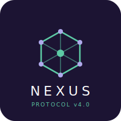

<p align="center">
  
</p>

<p align="center">
  <a href="../es/operadores.md">🇪🇸 Español</a> · <strong>🇺🇸 English</strong>
</p>

# NEXUS Operator Dictionary

Complete reference for all NEXUS protocol operators v4.1.0.

---

## `@` — Directive

**Purpose:** Defines the environment, framework, or behavior mode for the NEXUS block.

**Syntax:**
```nexus
@Framework
@Framework @AnotherFramework
@modify [preserve:all]
```

**Examples:**
```nexus
@React @Tailwind
@NestJS @Prisma @PostgreSQL
@modify [preserve:all]
```

**Notes:**
- Always on the first line of a NEXUS block
- Multiple directives can be chained on the same line
- `@modify [preserve:all]` tells the AI to only apply the explicit change — no reinterpretation, no moving other elements

---

## `#` — Style Token

**Purpose:** Applies design tokens or style classes to an element.

**Syntax:**
```nexus
Element #token
Element #token1 #token2
```

**Examples:**
```nexus
Section Hero #glass
Button "Save" #primary #rounded
Card #glass #shadow-lg
```

**Notes:**
- Multiple tokens can be chained
- Tokens are defined by the project DNA (`nexus.config.json`)
- Not validated against a fixed list — the AI interprets them based on the stack

---

## `$` — Global Variable (DNA)

**Purpose:** Declares global constants or project DNA values.

**Syntax:**
```nexus
$name: value
```

**Examples:**
```nexus
$brand: "Nexus"
$primary-color: "#5DCAA5"
$api-base: "/api/v1"
```

---

## `~` — Local State

**Purpose:** Declares local reactive state variables (equivalent to `useState` in React or `ref` in Vue).

**Syntax:**
```nexus
~name: initialValue
```

**Examples:**
```nexus
~isOpen: false
~currentPage: 1
~searchQuery: ""
```

**Notes:**
- Scoped to the component or page where it is declared
- Can be referenced in `[page:~variable]` for pagination

---

## `|` — Responsive Variant

**Purpose:** Defines design variations by screen size.

**Syntax:**
```nexus
Element [property:mobileValue | property:desktopValue]
```

**Examples:**
```nexus
Grid [cols:1 | cols:3]
Nav |mobile:hide
```

---

## `* N` — Multiplier

**Purpose:** Repeats an element N times.

**Syntax:**
```nexus
Element * N
```

**Examples:**
```nexus
Card * 3
SkeletonRow * 5
```

**Common errors:**
- Cannot be combined with `[paginate:N]` on the same line

---

## `?` — UI State

**Purpose:** Defines visual or logical variants of the component.

**Syntax:**
```nexus
?state
?state:Component
```

**Examples:**
```nexus
?loading:Skeleton
?error:ErrorBanner
?empty:EmptyState
```

---

## `!` — Priority / Flag

**Purpose:** Applies visual weight, behavior, or constraint modifiers.

**Syntax:**
```nexus
Element !modifier
Element !mod1 !mod2
```

**Examples:**
```nexus
Text "Title" !bold !xl
Button "Delete" !danger
Entity id !pk
```

---

## `!pk` — Primary Key

**Purpose:** Marks a field as the entity's primary key.

**Syntax:**
```nexus
Entity field !pk
Entity field type:uuid !pk
```

**Notes:**
- Only valid inside `Model` blocks
- Only one `!pk` per model

---

## `!error:` — Error Handler

**Purpose:** Catches errors from `=>` actions and redirects to the specified destination.

**Syntax:**
```nexus
Element => Service.method()
  !error:code -> /destination
```

**Valid codes:**

| Code | Type |
|---|---|
| `400`–`599` | HTTP status code (400, 401, 403, 404, 500…) |
| `timeout` | Request exceeded time limit |
| `network` | Network error / no connection |
| `*` | Wildcard — catches any unhandled error |

**Full example:**
```nexus
Button "Pay" => PaymentService.process()
  !error:400 -> /error/payment
  !error:401 -> /login
  !error:500 -> /error/server
  !error:timeout -> /retry
  !error:* -> /error/general
```

**Rules:**
- Only valid indented under a line with `=>`
- Always requires `-> /destination` after the code
- Multiple `!error` can be chained under the same `=>`

**Common errors:**
- `!error:600` — invalid HTTP code (must be 400–599)
- `!error:network` without `->` — missing destination

---

## `!!` — Assertion (Precondition)

**Purpose:** Declares explicit preconditions that must be met before executing a `=>` action. If any fails, the action is NOT executed.

**Syntax:**
```nexus
!! "description"
!! expression
```

**Forms:**

| Form | Generated behavior |
|---|---|
| `!! "message"` | Semantic guard: generates a validation check with that message as the error text |
| `!! expression` | Logical guard: generates `if (!expression) { ... }` with appropriate error handling |

**Examples:**
```nexus
Endpoint POST /checkout
  !! "Cart cannot be empty"
  !! stock.available > 0
  !! user.authenticated
  => OrderService.create()
```

```nexus
Form Payment
  !! "All fields are required"
  !! card.valid
  => PaymentService.process()
    !error:400 -> /error/validation
    !error:timeout -> /retry
```

**Rules:**
- Always appears before the `=>` line it protects
- Multiple `!!` are evaluated strictly top-to-bottom — first failure stops execution
- Content is required: `!!` without text generates a validation error
- `!!` NEVER appears as a literal comment in generated code — it becomes executable guard logic

**Generated code (React/Next.js):**
```typescript
if (cart.isEmpty()) {
  setError('Cart cannot be empty')
  return
}
if (stock.available <= 0) {
  setError('Insufficient stock')
  return
}
if (!user.authenticated) {
  setError('User not authenticated')
  return
}
return await OrderService.create(...)
```

**Generated code (NestJS/Express):**
```typescript
if (cart.isEmpty()) throw new BadRequestException('Cart cannot be empty')
if (stock.available <= 0) throw new BadRequestException('Insufficient stock')
if (!user.authenticated) throw new UnauthorizedException()
return await OrderService.create(...)
```

**Common errors:**
- `!!` without content → error: `"!!" requires content`
- `!!   ` (spaces only) → error: `"!!" requires content`

---

## `@Auth` — Authentication

**Purpose:** Requires authentication for an endpoint or resource.

**Syntax:**
```nexus
@Auth
@Auth[mode:jwt]
@Auth[role:admin]
```

**Examples:**
```nexus
Endpoint GET /profile @Auth => UserService.getProfile()
Endpoint DELETE /user @Auth[role:admin] => UserService.delete()
```

---

## `@RateLimit` — Rate Limiting

**Purpose:** Limits the request frequency to an endpoint.

**Syntax:**
```nexus
@RateLimit[N/unit]
```

**Examples:**
```nexus
@RateLimit[100/min]
@RateLimit[1000/hour]
```

---

## `??` — Quick Query

**Purpose:** Ask the AI a question without leaving NEXUS mode.

**Syntax:**
```nexus
?? "question"
```

**Examples:**
```nexus
?? "Should I use Zustand or Context here?"
?? "Does this endpoint need rate limiting?"
```

**Notes:**
- The AI answers briefly and then continues generating code

---

## `->` — Navigation / Relation

**Purpose:** Defines navigation between pages, routes, or relations between models.

**Syntax:**
```nexus
Element -> /route
Button -> /destination
Entity field -> Model.Name [modifier]
```

**Model relation modifiers:**

| Modifier | Cardinality |
|---|---|
| *(no modifier)* | One-to-one required (NOT NULL) |
| `[many]` | One-to-many |
| `[optional]` | Optional (allows NULL) |
| `[cascade]` | Deletes children when parent is deleted |

**Examples:**
```nexus
Button "Home" -> /dashboard
Model Order
  Entity user -> Model.User
  Entity items -> Model.Product [many]
  Entity category -> Model.Category [optional]
  Entity invoices -> Model.Invoice [many, cascade]
```

**Rules for `-> Model.Name`:**
- Only valid inside an `Entity` line
- The referenced model name must start with uppercase
- Valid modifiers: `many`, `optional`, `cascade`

---

## `=>` — Side Effect

**Purpose:** Dispatches actions, calls APIs, or defines event handlers.

**Syntax:**
```nexus
Element => Service.method()
Element => Store.action(payload)
```

**Examples:**
```nexus
Button "Save" => FormService.save()
Form => UserService.create()
Input onChange => Store.setFilter(value)
```

---

## `<` — Data Binding

**Purpose:** Binds an element to a data source or TypeScript type.

**Syntax:**
```nexus
Element < Source
Endpoint METHOD /route < Payload:Schema
```

**Examples:**
```nexus
Table < Order
Chart < SalesData
Endpoint POST /users < Payload:UserSchema => UserService.create()
```

---

## `{ }` — Inject

**Purpose:** Injects an existing file or context into the NEXUS block.

**Syntax:**
```nexus
{ ./path/to/file }
```

**Examples:**
```nexus
{ ./components/UserCard.tsx }
{ ./utils/auth.ts }
```

---

## `[paginate:N]` — Native Pagination

**Purpose:** Generates automatic pagination on data-bound elements.

**Syntax:**
```nexus
Element < Source [paginate:N]
Element < Source [paginate:N, page:~variable]
Element < Source [paginate:N, layout:grid|list]
```

**Parameters:**

| Parameter | Description | Values |
|---|---|---|
| `paginate:N` | Items per page (required) | Integer between 1 and 500 |
| `page:~var` | State variable for current page | Local variable `~name` |
| `layout:X` | Visual layout | `grid` \| `list` |

**Examples:**
```nexus
Table < Order [paginate:20]
Table < User [paginate:10, page:~currentPage]
List < Product [paginate:12, layout:grid]
```

**Rules:**
- Requires data binding `<` on the same line
- Cannot be combined with `* N`
- N must be an integer between 1 and 500

**Common errors:**
- `Table [paginate:20]` without `<` — missing data binding
- `Table < Data [paginate:600]` — N out of range
- `Card * 3 [paginate:10]` — conflict with multiplier

---

## `( cond ) -> A : B` — Conditional

**Purpose:** Conditional rendering based on a logical expression.

**Syntax:**
```nexus
( condition ) ->
  TrueComponent
:
  FalseComponent
```

**Examples:**
```nexus
( product.inStock ) ->
  Button "Add to cart" => CartStore.add(product)
:
  Badge "Out of stock" #muted

( ?auth ) ->
  Dashboard
:
  LoginPage
```

---

## `[new]` / `[locked]` — Modification Control

**`[new]`** — Marks an element as newly added (useful with `@modify`).

**`[locked]`** — Tells the AI not to modify or regenerate this element.

**Examples:**
```nexus
@modify [preserve:all]
Page Dashboard
  Navbar [locked]
  Section New [new]
    Button "New" [new]
```

---

## `[animate:]` / `[hover:]` / `[a11y:]` — Special Attributes

**`[animate:]`** — Entry/exit animation.
```nexus
Card [animate: fade-in, duration: 200ms]
```

**`[hover:]`** — Hover styles.
```nexus
Button "View" [hover: scale-105]
```

**`[a11y:]`** — ARIA accessibility attributes.
```nexus
Button "Close" [a11y: aria-label="Close modal"]
```

---

*[← Back to grammar](./grammar.md) · [See examples →](./examples.md)*
